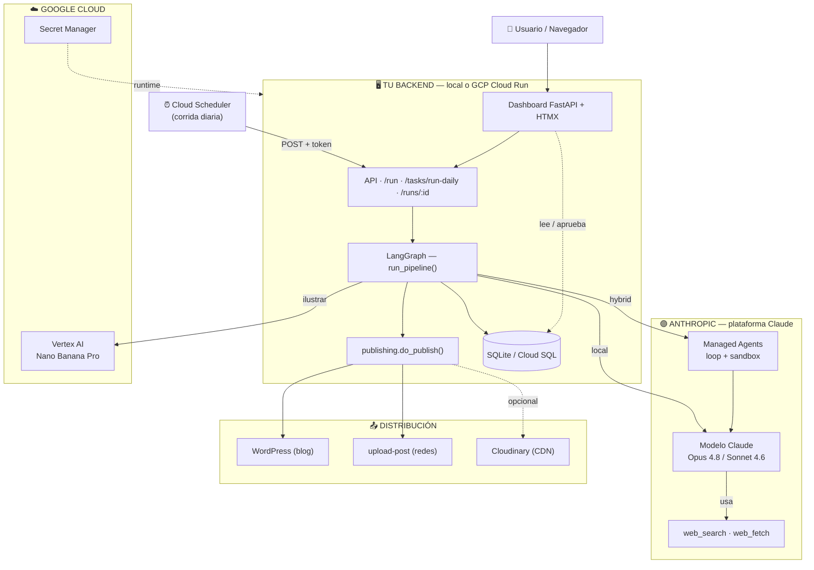
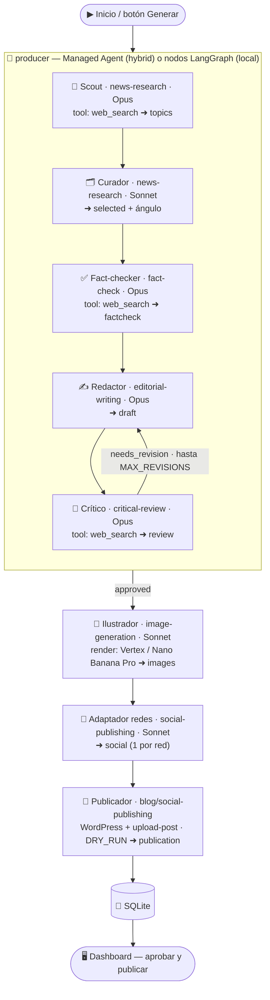

# 🏠 realestate-editorial-agents

**Tutorial completo: construí tu propio sistema multiagente con la plataforma
Claude + LangGraph, con dashboard web y listo para GCP.**

Un **equipo editorial autónomo** que, todos los días, busca noticias de **Real
Estate de Argentina y Latinoamérica**, **valida los datos** con fuentes
independientes, redacta un **editorial profesional**, lo somete a una
**revalidación crítica**, genera **imágenes** (Gemini "Nano Banana") y lo **publica
en un blog y en todas las redes** — con un **dashboard de revisión/aprobación** y
**runtime híbrido** (LangGraph + agentes en la plataforma de Claude).

> Este repo es a la vez un **tutorial paso a paso** (`docs/`) y un **proyecto
> funcional** que podés correr local y deployar a GCP.

---

## ✨ Qué incluye

- **Equipo de agentes** con **LangGraph** (estado compartido, bucle de revalidación crítica).
- **Runtime híbrido**: la producción autónoma corre como **Managed Agent** en la
  plataforma de Claude; LangGraph orquesta el resto. (También hay modo `local`.)
- **Claude** (`claude-opus-4-8` / `claude-sonnet-4-6`): *structured outputs*,
  razonamiento adaptativo y **`web_search`/`web_fetch`** server-side (o **Tavily**).
- **7 Claude Agent Skills** (`skills/`), una por funcionalidad.
- **Imágenes** con **Gemini "Nano Banana"** (`gemini-3-pro-image`) + **Cloudinary**.
- **Publicación** en **WordPress** + todas las redes con **upload-post**.
- **Dashboard FastAPI + HTMX**: revisar, editar y **aprobar antes de publicar**.
- **Persistencia SQLite** (historial de corridas).
- **Listo para GCP**: Dockerfile (Cloud Run), Secret Manager, Cloud Scheduler.
- **DRY_RUN seguro por defecto** + tests (verde) + docs.

## 🗺️ Arquitectura del sistema

> Verde = Anthropic · Celeste = Google Cloud · el bloque central es **tu código** (local o Cloud Run).



## 🧠 El equipo de agentes (en detalle)

Cada agente: una responsabilidad, una **skill**, un **modelo**. En `hybrid`, el bloque
`producer` lo corre el Managed Agent en Anthropic; en `local`, son nodos LangGraph en tu backend.



Más detalle en [docs/01-arquitectura.md](docs/01-arquitectura.md).

## 🚀 Quickstart (local)

```bash
# Requiere Python 3.10+. ¿No tenés? Usá uv (ver docs/02): uv venv + `uv pip install`.
python3 -m venv .venv && source .venv/bin/activate
pip install -e ".[dev]"     # núcleo + tests (incluye Gemini, FastAPI, LangGraph...)

cp .env.example .env        # poné ANTHROPIC_API_KEY (y GEMINI_API_KEY si querés imágenes)
make web                    # dashboard en http://localhost:8080 → "+ Generar editorial"
# o por CLI:  make dry-run  (genera y guarda sin publicar)
```

> Detalle de instalación, costos y troubleshooting: [docs/02-instalacion.md](docs/02-instalacion.md).

> Sin acceso a Managed Agents, el runtime híbrido **cae a `local` automáticamente**:
> el tutorial corre igual.

## ☁️ Deploy a GCP (Cloud Run)

```bash
gcloud auth login
export GCP_PROJECT=supple-framing-498515-a0 REGION=southamerica-east1
bash deploy/push-secrets.sh .env     # secretos → Secret Manager
bash deploy/deploy.sh                 # build + deploy a Cloud Run
bash deploy/scheduler.sh              # cron diario 08:00 AR (Cloud Scheduler)
```

Detalle en [docs/10-deploy-gcp.md](docs/10-deploy-gcp.md).

## 📚 Tutorial

1. [Arquitectura](docs/01-arquitectura.md) — con **diagramas** del sistema y de los agentes
2. [Instalación](docs/02-instalacion.md)
3. [Skills](docs/03-skills.md)
4. [Agentes y LangGraph](docs/04-agentes-langgraph.md)
5. [Publicación: blog, redes e imágenes](docs/05-publicacion-redes.md)
6. [Scheduling](docs/06-scheduling.md)
7. [Claude Cowork](docs/07-cowork.md)
8. [Mejores prácticas](docs/08-mejores-practicas.md)
9. [La UI (dashboard)](docs/09-ui.md)
10. [Despliegue en GCP](docs/10-deploy-gcp.md)
11. [Runtime híbrido / Managed Agents](docs/11-managed-agents.md)

## 🗂️ Estructura

```
src/editorial_team/
  ├─ agents/             # nodos: producer (híbrido), scout, writer, critic, ...
  ├─ integrations/       # managed_agents, images (Gemini), image_host (Cloudinary),
  │                      #   search (Tavily), wordpress, upload_post
  ├─ webapp/             # dashboard FastAPI + HTMX (templates/)
  ├─ graph.py services.py storage.py publishing.py llm.py schemas.py config.py
  └─ gcp_secrets.py run_daily.py
skills/                  # 7 Claude Agent Skills
deploy/                  # scripts GCP (deploy, push-secrets, scheduler)
Dockerfile               # imagen para Cloud Run
cowork/PROMPT.md         # prompt para Claude Cowork
docs/                    # este tutorial
tests/                   # tests (sin red ni API key) — verde
```

## 🔧 Stack

| | |
|---|---|
| Orquestación | LangGraph (+ Managed Agents en híbrido) |
| Modelo | Claude `claude-opus-4-8` / `claude-sonnet-4-6` |
| Investigación | `web_search`/`web_fetch` o Tavily |
| Imágenes | Gemini `gemini-3-pro-image` ("Nano Banana") + Cloudinary |
| Blog / Redes | WordPress REST · upload-post.com |
| UI / Backend | FastAPI + HTMX |
| Persistencia | SQLite (local) / Cloud SQL (GCP) |
| Despliegue | GCP Cloud Run · Secret Manager · Cloud Scheduler |

## 🔐 Seguridad

- Secretos sólo en `.env` (local) o **Secret Manager** (GCP). En el repo público,
  sólo `.env.example` con placeholders.
- WordPress con **Application Password**; **`DRY_RUN=true`** por defecto.
- El dashboard no trae auth propia: en producción protegelo (IAM/IAP).

## 📄 Licencia

[MIT](LICENSE). Proyecto educativo; verificá el contenido antes de publicar.
