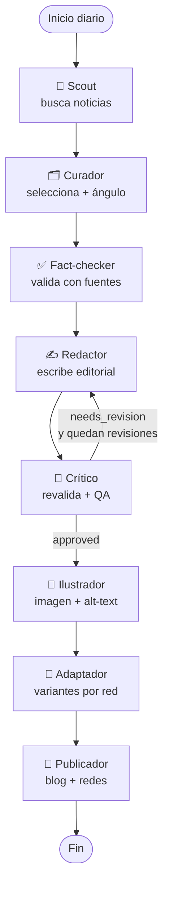

# 01 · Arquitectura

Este tutorial construye un **equipo editorial multiagente**: un conjunto de agentes
especializados que, coordinados por un grafo, investigan, validan, redactan,
revalidan, ilustran y publican un editorial de Real Estate todos los días.

## El stack y por qué

| Pieza | Elección | Por qué |
|-------|----------|---------|
| Orquestación | **LangGraph** | Modela el equipo como un grafo de estados con bucles (revisión crítica), ramas condicionales y memoria compartida. Determinístico y testeable. |
| Modelo | **Claude** (`claude-opus-4-8` / `claude-sonnet-4-6`) vía SDK oficial `anthropic` | Razonamiento adaptativo, *structured outputs* y herramientas web server-side. Control exacto de la API. |
| Búsqueda y verificación | **`web_search` + `web_fetch`** (herramientas server-side de Claude) | Investigación con citas, sin montar un buscador propio. |
| Skills | **Claude Agent Skills** (`skills/`) | Encapsulan el "cómo" de cada función; reutilizables por el workflow programático y por Cowork. |
| Publicación | **WordPress REST** + **upload-post.com** | Blog + todas las redes con clientes simples y reemplazables. |
| Imágenes | Proveedor configurable (`gpt-image-1` por defecto) | Claude no genera imágenes: escribe el prompt; un proveedor externo renderiza. |

## El equipo (agentes = nodos del grafo)



Cada agente tiene **una** responsabilidad (principio de responsabilidad única) y
una **skill** asociada que documenta su procedimiento y criterios de calidad.

## El estado compartido

LangGraph pasa un diccionario tipado (`EditorialState`) de nodo en nodo. Cada
agente lee lo que necesita y escribe sólo sus claves:

```
topics → selected → factcheck → draft ⇄ review → images → social → publication
```

Ver `src/editorial_team/state.py`.

## El bucle de calidad

La arista condicional después de `critic` es el corazón del diseño: si el editor
crítico encuentra problemas, **devuelve el texto al redactor** con notas
accionables, hasta `MAX_REVISIONS` veces. Esto implementa la *revalidación
crítica* que evita publicar datos flojos.

## Dos modos de ejecución

1. **Programático (LangGraph)** — `python -m editorial_team.run_daily`. El que ves
   en `src/`. Determinístico, ideal para cron / CI. → [04-agentes-langgraph.md](04-agentes-langgraph.md)
2. **Agente autónomo (Claude Cowork)** — el mismo equipo expresado como prompt +
   skills, que un agente Claude ejecuta. → [07-cowork.md](07-cowork.md)

Ambos comparten las **mismas skills** (`skills/`): la especificación del "cómo" es
única; cambia sólo quién la ejecuta.

## Siguiente
→ [02-instalacion.md](02-instalacion.md)
