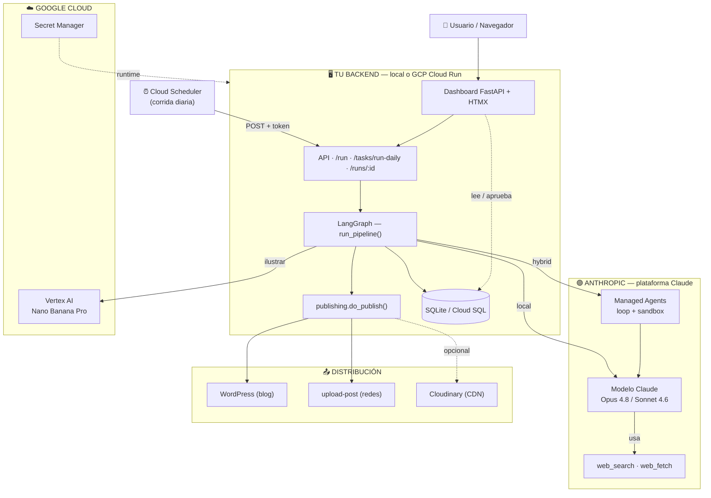
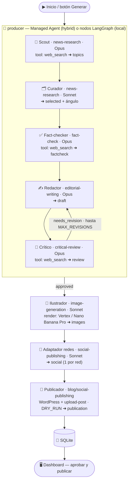

# 01 · Arquitectura

Este tutorial construye un **equipo editorial multiagente**: agentes especializados
que, coordinados por un grafo, investigan, validan, redactan, revalidan, ilustran y
publican un editorial de Real Estate todos los días — con un **dashboard** para
revisar y aprobar antes de publicar.

## El modelo mental en 30 segundos

Es fácil mezclar dos cosas distintas. Separalas y todo se aclara:

- **Eje 1 — ¿dónde corre TU código?** En tu máquina (local) o en la nube (**GCP
  Cloud Run**). Acá viven el backend, la UI, el scheduler y la base de datos.
- **Eje 2 — ¿quién corre el LOOP de los agentes?** O lo corre tu código con
  **LangGraph** (`AGENT_RUNTIME=local`), o lo corre **Anthropic** con **Managed
  Agents** (`AGENT_RUNTIME=hybrid`).

Son **independientes**: podés correr el runtime híbrido desde tu laptop, o el local
en Cloud Run. Y el **modelo Claude siempre está en Anthropic** (lo llamás por API
desde donde sea).

| Pieza | Dónde vive | Quién la opera |
|-------|-----------|----------------|
| **Modelo Claude** | Infra de Anthropic | Anthropic (API) |
| **Skills** (`skills/`) | tu repo | vos (las usa el grafo y/o el Managed Agent) |
| **Loop de agentes** | tu código **o** Anthropic | LangGraph **o** Managed Agents |
| **Backend + UI + scheduler + DB** | local **o** GCP Cloud Run | vos |

> El runtime **híbrido es el default** y honra "agentes en la plataforma de Claude".
> Si tu cuenta no tiene la beta de Managed Agents, **cae a `local` automáticamente**:
> el tutorial corre igual. Detalle en [11-managed-agents.md](11-managed-agents.md).

## El stack y por qué

| Pieza | Elección | Por qué |
|-------|----------|---------|
| Orquestación | **LangGraph** | Modela el equipo como un grafo con bucles (revisión crítica) y ramas. Determinístico y testeable. |
| Modelo | **Claude** (`claude-opus-4-8` / `claude-sonnet-4-6`) | *Structured outputs*, razonamiento adaptativo y herramientas web server-side. |
| Búsqueda | **`web_search`/`web_fetch`** (Claude) o **Tavily** | Investigación con citas (`RESEARCH_BACKEND`). |
| Skills | **Claude Agent Skills** (`skills/`) | Encapsulan el "cómo"; las usa el grafo y el Managed Agent. |
| Runtime de agentes | **LangGraph** + **Managed Agents** (híbrido) | LangGraph orquesta; la producción autónoma corre en la plataforma de Claude. |
| Publicación | **WordPress REST** + **upload-post.com** | Blog + todas las redes con clientes reemplazables. |
| Imágenes | **Gemini "Nano Banana Pro"** (`gemini-3-pro-image`) vía AI Studio o **Vertex AI** | Claude escribe el prompt; Gemini renderiza. Vertex factura por GCP. |
| UI + Backend | **FastAPI + HTMX** | Panel de revisión/aprobación (human-in-the-loop). |
| Persistencia | **SQLite** (local) / Cloud SQL (GCP) | Historial de corridas; habilita la UI. |
| Despliegue | **GCP Cloud Run** + Secret Manager + Cloud Scheduler | Local-first, listo para la nube. |

## Diagrama de arquitectura del sistema

Visión general de las piezas y los flujos. Verde = Anthropic, celeste = Google Cloud;
el bloque central es **tu código** (local o Cloud Run).



## Diagrama de agentes en detalle

Cada agente tiene **una responsabilidad**, una **skill** y un **modelo**. En `hybrid`,
el bloque `producer` lo ejecuta el Managed Agent en Anthropic; en `local`, esos 5
agentes corren como nodos LangGraph en tu backend (mismas skills, mismo bucle).



**Cómo leerlo:** cada flecha pasa el estado al siguiente agente. El bucle
`crítico → redactor` es la **revalidación crítica** (hasta `MAX_REVISIONS`). De
`producer` para abajo (ilustrar → redes → publicar → persistir) es **idéntico** en
ambos runtimes.

## El estado compartido

LangGraph pasa un diccionario tipado (`EditorialState`) de nodo en nodo. Cada nodo
lee lo que necesita y escribe sólo sus claves:

```
(producer | scout→…→critic) → draft + factcheck + review → images → social → publication
```

Ver `src/editorial_team/state.py`.

## El bucle de calidad (revalidación crítica)

El corazón del diseño: el crítico revalida los datos de forma independiente y, si
encuentra problemas, **devuelve el texto al redactor** con notas accionables, hasta
`MAX_REVISIONS` veces. En híbrido, ese mismo bucle lo ejecuta el Managed Agent
siguiendo la skill `critical-review`. Así no se publican datos flojos.

## Por dónde seguir

- Ponerlo a andar y verlo: [02-instalacion.md](02-instalacion.md)
- Las skills: [03-skills.md](03-skills.md)
- El código LangGraph: [04-agentes-langgraph.md](04-agentes-langgraph.md)
- La UI: [09-ui.md](09-ui.md) · GCP: [10-deploy-gcp.md](10-deploy-gcp.md) · Híbrido: [11-managed-agents.md](11-managed-agents.md)

## Siguiente
→ [02-instalacion.md](02-instalacion.md)
